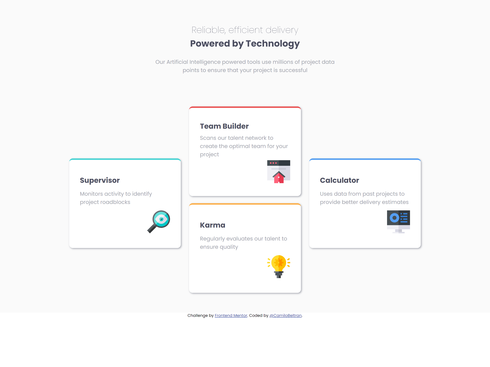

# Frontend Mentor - Four card feature section solution

This is a solution to the [Four card feature section challenge on Frontend Mentor](https://www.frontendmentor.io/challenges/four-card-feature-section-weK1eFYK). Frontend Mentor challenges help you improve your coding skills by building realistic projects.

## Overview

### The challenge

Users should be able to:

- View the optimal layout for the site depending on their device's screen size

### Screenshot

### Links

- Solution URL: [Add solution URL here](https://your-solution-url.com)
- Live Site URL: [Add live site URL here](https://your-live-site-url.com)

## My process

### Built with

- Semantic HTML5 markup
- CSS custom properties
- Flexbox
- Mobile-first workflow

### What I learned

What's Good ?

at this moment i'm learning

- JavaScript
- React.js
- Angular.js

### Continued development

## Author

- Website - [@CamiloBeltrán](https://camilobeltran24.github.io/Portfolio/)
- Frontend Mentor - [@CamiloBeltran24](https://www.frontendmentor.io/profile/CamiloBeltran24)
- Twitter - [@CamiloBeltran](https://twitter.com/CamiloBeltran)
